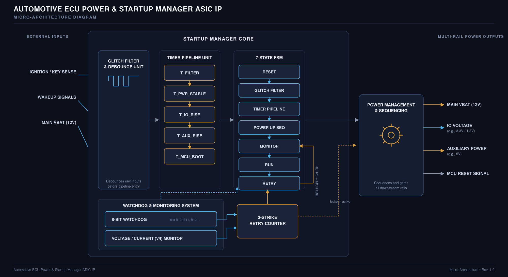
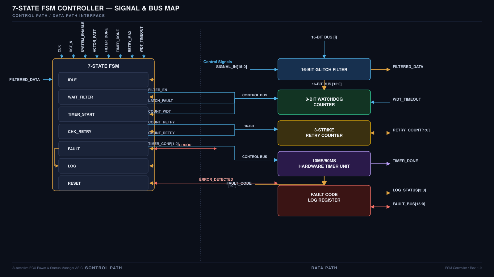
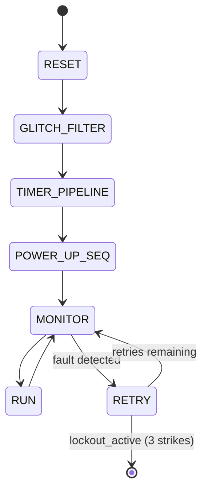
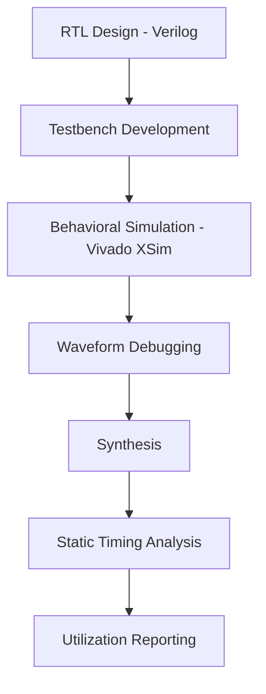
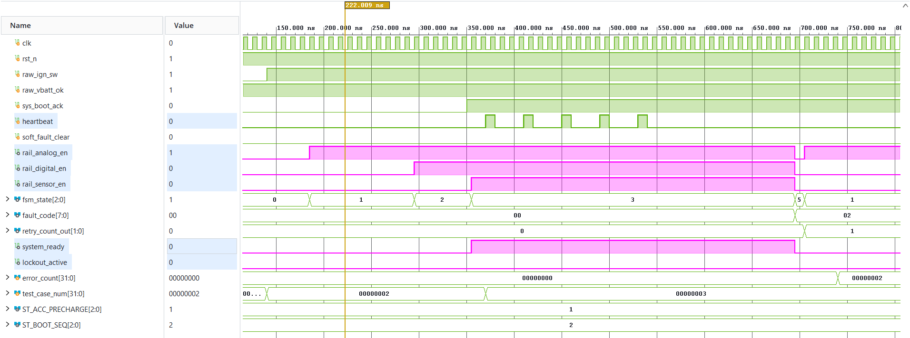

# Automotive ECU Power & Startup Manager IP


-informational?style=flat-square)


A synthesizable Verilog IP that manages power-up sequencing, brown-out filtering, and fault recovery for multi-rail automotive ECUs. Everything — the debounce stage, the timer pipeline, the sequencing FSM, and the watchdog/retry logic — is built to run off a single system clock and reset, with no vendor primitives, no BRAM, and no DSP blocks in the critical path.

<p align="center">

</p>
<p align="center"><i>Top-level micro-architecture — external sense inputs, glitch filtering, timer pipeline, 7-state FSM, and multi-rail power sequencing</i></p>

---

## Table of Contents

- [Project Overview](#project-overview)
- [Key Features](#key-features)
- [Architecture](#architecture)
- [FSM Design](#fsm-design)
- [Design Flow](#design-flow)
- [Simulation](#simulation)
- [Synthesis & Resource Utilization](#synthesis--resource-utilization)
- [Timing Analysis](#timing-analysis)
- [Repository Structure](#repository-structure)
- [Tools Used](#tools-used)
- [How to Run](#how-to-run)
- [Future Improvements](#future-improvements)
- [License](#license)
- [Author](#author)

---

## Project Overview

Automotive ECUs power up under some genuinely nasty conditions — cranking sags on the main rail, relay contacts bouncing on `IGN` and wake-up lines, and multiple downstream rails (analog, digital, sensor) that all need to come up in a specific order, not all at once. If an ECU's power sequencer just reacts to raw pin states, a single noisy transition during cranking can trigger a bogus power-up, a partial rail enable, or worse, an unbounded reset loop that never lets the MCU actually boot.

This project is a self-contained IP block that handles that problem in hardware, before it ever reaches the MCU. Raw ignition/wake-up/VBAT inputs are debounced, run through a timed power-up pipeline, and sequenced through a 7-state FSM that gates the downstream rails one at a time. A watchdog and a 3-strike retry counter sit on top of that, so a transient fault triggers a bounded retry instead of an infinite reset loop, and a genuinely bad fault trips a safe-state lockout instead of leaving the rails in an undefined condition.

It was built and verified in Vivado 2022.2 targeting an Artix-7 (`xc7a35tcpg236-1`) as the synthesis/STA vehicle — the RTL itself is written to be technology-agnostic, since the actual deployment target for this class of IP is an ASIC flow.

---

## Key Features

- **7-state FSM sequencer** (`ecu_pwr_fsm`) coordinating power-up, monitoring, retry, and graceful shutdown across multiple rails from a single control core.
- **16-bit glitch filter / debounce stage**, instantiated twice (once each for the ignition sense line and the VBAT-OK line) to reject relay chatter and short voltage transients during cranking before they reach the FSM.
- **5-stage hardware timer pipeline** (`T_FILTER → T_PWR_STABLE → T_IO_RISE → T_AUX_RISE → T_MCU_BOOT`) enforcing the 10 ms / 50 ms style timing windows between debounce, power stabilization, IO rise, auxiliary rail rise, and MCU boot release.
- **Sequential, staggered rail enabling** — `rail_analog_en`, `rail_digital_en`, and `rail_sensor_en` are brought up one at a time rather than simultaneously, confirmed directly in simulation.
- **8-bit watchdog + voltage/current monitor** feeding a 3-strike retry counter, so a transient fault causes a bounded retry through the FSM instead of a hard reset.
- **Safe-state lockout** (`lockout_active`) gating all downstream rails once the retry budget is exhausted, so the design fails to a known-safe state rather than looping indefinitely.
- **Fault code and status reporting** (`fault_code[7:0]`, `retry_count_out[1:0]`, `error_count[31:0]`) for diagnosability during bring-up and test.
- **100% synchronous, single-clock design** — zero latches, zero Block RAM, zero DSP usage, confirmed by the utilization report.

---

## Architecture

<p align="center">

</p>
<p align="center"><i>FSM ↔ data-path signal and bus map — control-path connections from the FSM into the glitch filter, watchdog, retry counter, timer unit, and fault log register</i></p>

The design is organized as a control path (the FSM) driving a data path (filter, timers, counters, fault registers), which is exactly the split the two diagrams above show from different angles:

| Block | Role |
|---|---|
| **Glitch Filter & Debounce Unit** | 16-bit filter on the raw ignition/wake-up and VBAT sense lines; strips relay bounce and short transients before anything downstream sees the signal. |
| **Timer Pipeline Unit** | Five-stage timed sequence (`T_FILTER`, `T_PWR_STABLE`, `T_IO_RISE`, `T_AUX_RISE`, `T_MCU_BOOT`) that paces the power-up sequence instead of letting rails snap up back-to-back. |
| **7-State FSM** | The sequencing core — walks the system from reset through filtering, timing, power-up, monitoring, running, and retry. |
| **Watchdog & Monitoring System** | 8-bit watchdog plus a voltage/current monitor feeding the retry counter — this is what actually notices something's gone wrong. |
| **3-Strike Retry Counter** | Counts consecutive faults; loops the FSM back through `RETRY → MONITOR` for the first two, then asserts `lockout_active` on the third to force a safe state. |
| **Power Management & Sequencing** | Gates and sequences the downstream rails (Main VBAT, IO voltage, auxiliary power) and drives the MCU reset signal once the sequence completes. |

Per the synthesized hierarchy, the watchdog and retry-counter logic are folded directly into the `ecu_pwr_fsm` module rather than instantiated as separate blocks — the utilization report shows only four top-level instances (two glitch filters, the timer unit, and the FSM), and their LUT/FF counts sum exactly to the top-level total.

---

## FSM Design

The FSM (`ecu_pwr_fsm`) drives the entire sequencing behavior. Per the architecture diagram, its state progression is:



The signal/bus map above documents the same seven-state control structure from the interface side — filter enable, retry counting, timer configuration, and fault/log signaling all originate from and feed back into this FSM. `MONITOR` is where the watchdog and V/I monitor are actively watched; a fault detected there routes to `RETRY`, which either loops back to `MONITOR` (if strikes remain) or forces the lockout path if the 3-strike budget is exhausted.

---

## Design Flow



---

## Simulation

<p align="center">

</p>
<p align="center"><i>Simulation waveform — boot sequencing, rail enable staggering, and a fault/retry event</i></p>

This trace covers the full sequence the FSM is meant to guarantee:

- **Boot sequencing.** With `rst_n` high and `raw_ign_sw` / `raw_vbat_ok` asserted, `fsm_state` steps cleanly through `0 → 1 → 2 → 3` as the design moves from reset, through glitch filtering, through the timer pipeline, and into the power-up sequence.
- **Staggered rail enable.** `rail_analog_en` comes up first, followed by `rail_digital_en`, followed by `rail_sensor_en` — each rail is gated on independently rather than all asserting at once, matching the sequential power-gating behavior the design is meant to enforce.
- **Heartbeat / boot acknowledge.** Once the FSM reaches its running state, `sys_boot_ack` goes high and `heartbeat` starts pulsing periodically, confirming the system considers itself up and healthy.
- **Fault and retry.** Later in the trace, `fault_code[7:0]` steps from `0x00` to `0x02` and `retry_count_out[1:0]` increments from `0` to `1` (with `error_count` incrementing in step), while the FSM transitions to state `5` and the rails momentarily drop before being re-sequenced. The FSM then returns to state `1`, consistent with the `RETRY → MONITOR` loop in the architecture diagram. `lockout_active` stays low throughout this window, meaning the fault stayed within the retry budget and never forced a lockout.

Simulation was run with a `test_case_num` field driving directed test cases (values `2` and `3` visible in this trace), which is consistent with a directed testbench rather than a randomized/constrained one.

---

## Synthesis & Resource Utilization

Synthesized in Vivado 2022.2, targeting `xc7a35tcpg236-1` (Artix-7), design top `ecu_pwr_top`.

| Resource | Used | Available | Utilization |
|---|---|---|---|
| Slice LUTs | 86 | 20,800 | 0.41% |
| Slice Registers (FFs) | 72 | 41,600 | 0.17% |
| Bonded IOB | 22 | 106 | 20.75% |
| Block RAM Tiles | 0 | 50 | 0.00% |
| DSPs | 0 | 90 | 0.00% |

**Hierarchical breakdown:**

| Instance | Module | LUTs | FFs |
|---|---|---|---|
| `u_glitch_filter_ign` | `glitch_filter` (N=16) | 12 | 6 |
| `u_glitch_filter_vbat` | `glitch_filter` (N=16) | 12 | 6 |
| `u_timer_unit` | `timer_unit` | 38 | 34 |
| `u_ecu_pwr_fsm` | `ecu_pwr_fsm` | 24 | 26 |
| **Total** | | **86** | **72** |

Zero latches inferred, zero Block RAM / DSP required — 100% synchronous logic, and the two glitch filter instances confirm the "N-bit glitch filter" is specifically 16 bits wide on both the ignition-sense and VBAT-sense paths.

---

## Timing Analysis

Static Timing Analysis (multi-corner, pessimism removal enabled) targeting a 100 MHz (`sys_clk`, 10.000 ns period) constraint.

| Parameter | Setup | Hold | Pulse Width |
|---|---|---|---|
| Slack (WNS/WHS/WPWS) | 3.421 ns | 0.145 ns | 4.500 ns |
| TNS / THS / TPWS | 0.000 | 0.000 | 0.000 |
| Failing Endpoints | 0 / 148 | 0 / 148 | 0 / 73 |

**All user-specified timing constraints were met** — no failing setup, hold, or pulse-width endpoints across the design.

**Critical path (setup):**
`u_timer_unit/timer_counter_reg[18]/C` → `u_ecu_pwr_fsm/current_state_reg[1]/D`

- Data path delay: 6.179 ns (2.812 ns logic / 3.367 ns route — logic-dominated but route is still over half the path)
- Required time: 9.620 ns, Arrival time: 6.199 ns → **3.421 ns slack**

The critical path runs from a bit in the timer pipeline's counter, through the `precharge_done` combinational logic, into the FSM's next-state decoding, and into the FSM state register. That's expected — the timer unit is the widest counter logic in the design (38 LUTs), and its output directly gates FSM state transitions, so it's the natural bottleneck. With 3.421 ns of slack at 100 MHz, there's meaningful headroom before this path would need pipelining.

**Critical path (hold):**
`u_glitch_filter_ign/signal_out_reg/C` → `u_ecu_pwr_fsm/current_state_reg[0]/D`, 0.285 ns data path delay, 0.145 ns slack — comfortably met but worth keeping an eye on if the design is ever retargeted to a faster process, since hold margin doesn't scale the way setup margin does.

---

## Repository Structure

```text
Automotive-ECU-Power-Startup-Manager-IP/
├── reports/        # Timing, utilization, and architecture/signal-map diagrams
├── rtl/             # Synthesizable Verilog source
├── scratch/         # Working/scratch files
├── tb/              # Testbenches
├── waveform/        # Simulation waveform captures
├── LICENSE           # MIT License
└── README.md
```

---

## Tools Used

- **Verilog HDL** — RTL and testbench implementation.
- **Xilinx Vivado 2022.2**:
  - Vivado Simulator (XSim) — behavioral simulation and waveform debugging.
  - Vivado Synthesis — RTL to gate-level netlist.
  - Vivado Timing Analyzer — Static Timing Analysis and slack reporting.
  - Vivado Report Utilization — LUT/FF/IOB resource accounting.
- **Target device:** Xilinx Artix-7, `xc7a35tcpg236-1` (used as the synthesis/STA vehicle for this ASIC-oriented IP).

---

## How to Run

1. Clone the repository and open Vivado 2022.2 (or later).
2. Add the sources under `rtl/` as design sources and the files under `tb/` as simulation sources.
3. Run behavioral simulation (XSim) against the testbench in `tb/` to reproduce the waveform in `waveform/waveform_acu.png`.
4. Run synthesis on `ecu_pwr_top`, targeting `xc7a35tcpg236-1` (or your own Artix-7 part).
5. Run `report_timing_summary` and `report_utilization` to reproduce the numbers in `reports/timing_report.txt` and `reports/utilization_report.txt`.

---

## Future Improvements

- Move from directed test cases to randomized/constrained-random verification for the fault-injection and retry paths, to get better coverage of the FSM's `MONITOR ↔ RETRY` loop.
- Add formal or assertion-based checks around the 3-strike lockout condition, since it's a safety-critical property (no rail should ever re-enable once `lockout_active` is set without an explicit reset).
- Push the design through a full ASIC-oriented flow (as opposed to the FPGA-based STA vehicle used here) since the target application is ASIC IP.

---

## License

This project is licensed under the **MIT License** — see the [LICENSE](LICENSE) file for details.

---

## Author

**Samarpan Acharya**\\
**B.Tech. (ECE) - NIT ROURKELA**
